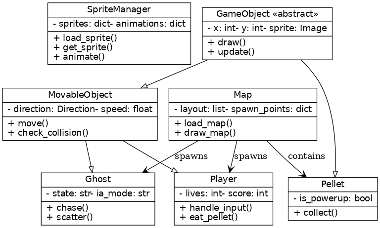

# Pac-Man Orientado a Objetos com Sprites 16x16

Um jogo Pac-Man implementado em Python usando princípios de programação orientada a objetos e a biblioteca Pygame, agora com **sprites reais 16x16**!

## Características do Projeto

### Conceitos de Orientação a Objetos Implementados:

1. **Encapsulamento**: Atributos privados com getters/setters apropriados
2. **Herança**: Hierarquia clara (GameObject → MovableObject → Player/Ghost)
3. **Abstração**: Classes abstratas e métodos abstratos
4. **Polimorfismo**: Métodos draw() e update() específicos para cada classe

### Funcionalidades do Jogo:

- ✅ **Sprites reais 16x16** carregados dos assets
- ✅ **Movimento suave** do Pac-Man com detecção de colisões
- ✅ **IA dos fantasmas** com diferentes comportamentos (scatter/chase/vulnerable)
- ✅ **Sistema de power-ups** com quadrados brancos piscantes
- ✅ **Sistema de pontuação** e vidas
- ✅ **Estados do jogo** (Menu, Jogando, Pausado, Game Over, Vitória)
- ✅ **Interface gráfica** completa com HUD
- ✅ **Animações** baseadas em sprites reais

## Instalação e Execução

### Pré-requisitos:
```bash
pip install pygame
```

Ou usar o arquivo requirements.txt:
```bash
pip install -r requirements.txt
```

### Executar o jogo:
```bash
python main.py
```

## Controles

- **Movimento**: WASD ou Setas direcionais
- **Pausa**: ESC (durante o jogo)
- **Menu**: ENTER (para navegar/reiniciar)

## Estrutura de Arquivos

```
assets/
├── sprites/
│   ├── pacman/           # Sprites do Pac-Man (16x16)
│   ├── ghosts/           # Sprites dos fantasmas (16x16)
│   │   ├── red/         
│   │   ├── pink/        
│   │   ├── blue/        
│   │   ├── yellow/      
│   │   └── vulnerable/   # Estados vulneráveis
│   └── power_ups/        # Power-ups (criados proceduralmente)

src/
├── __init__.py           # Módulo Python
├── utils.py             # Classes utilitárias (Vector2D, Direction, GameState)
├── sprite_manager.py    # ✨ NOVO: Gerenciador de sprites 16x16
├── game_objects.py      # Classes dos objetos do jogo (com sprites)
└── map.py              # Classe do mapa/labirinto

main.py                 # Arquivo principal do jogo
requirements.txt        # Dependências
```

## Sistema de Sprites

### ✨ **Novo SpriteManager**
- **Carregamento automático** de todos os sprites 16x16
- **Sistema de animação** para Pac-Man e fantasmas
- **Fallback inteligente** para sprites faltantes
- **Colorização procedural** para fantasmas sem sprites específicos

### 🎨 **Sprites Implementados:**

#### **Pac-Man** (sprites reais):
- `pac-fechado.png` - Pac-Man com boca fechada
- `pac-dir.png`, `pac-dir-ab.png` - Movimento direita
- `pac-esq.png`, `pac-esq-ab.png` - Movimento esquerda  
- `pac-cima.png`, `pac-cima-ab.png` - Movimento cima
- `pac-baixo.png`, `pac-baixo-fechado.png` - Movimento baixo

#### **Fantasmas** (sprites reais):
- **Vermelho**: `red-[direção]-[frame].png`
- **Outros cores**: Colorização automática dos sprites vermelhos
- **Vulneráveis**: `vulnerable-blue-[frame].png`, `vulnerable-white-[frame].png`

#### **Power-ups** (procedural):
- ⬜ Quadrados brancos piscantes (como solicitado)

#### **Paredes** (procedural):
- 🟦 Retângulos azuis (sem sprites disponíveis)

## Classes Principais

### `SpriteManager` ✨ **NOVO**
- Gerencia carregamento e animação de sprites 16x16
- Sistema inteligente de fallback
- Colorização automática para sprites faltantes

### `GameObject` (Abstrata)
- Classe base para todos os objetos do jogo
- Agora com suporte a sprites e animação
- Define interface comum (draw, update)

### `MovableObject` (Herda de GameObject)
- Adiciona capacidade de movimento
- Sistema de direções e velocidade
- Detecção de colisões otimizada para sprites 16x16

### `Player` (Herda de MovableObject)
- Implementa o Pac-Man com sprites reais
- Animação de boca baseada na direção
- Sistema de vidas, pontuação e power-ups
- Efeito visual durante power-up

### `Ghost` (Herda de MovableObject)
- Implementa os fantasmas com sprites reais
- IA com diferentes modos (scatter/chase)
- Estados com sprites específicos (normal/vulnerable)
- Animação fluida entre frames

### `Pellet` (Herda de GameObject)
- Pontos coletáveis com sprites
- Tipos: normal (círculo) e power-up (quadrado piscante)

### `Map`
- Gerencia o labirinto otimizado para 16x16
- Layout expandido (35x21 células)
- Sistema de spawn ajustado
- Desenho híbrido (sprites + procedural)

## Diagrama UML



## Melhorias Técnicas

### 🚀 **Performance:**
- Sprites carregados uma vez na inicialização
- Sistema de cache inteligente
- Detecção de colisões otimizada

### 🎨 **Visual:**
- Resolução 560x336 (35x21 células de 16px)
- Animações suaves baseadas em sprites
- Efeitos visuais para power-ups
- Colorização automática para fantasmas

### 🔧 **Código:**
- Separação clara entre sprites e lógica
- Sistema modular e extensível
- Fallbacks inteligentes para assets faltantes

## Para Executar:

```bash
# Instalar dependências
pip install pygame

# Executar o jogo com sprites
python main.py
```

## Tecnologias

- **Python 3.7+**
- **Pygame 2.5+**
- **Sprites 16x16** (formato PNG)
- **Programação Orientada a Objetos**
- **Padrões de Design**: State Machine, Strategy, Manager

---

**✨ Novidade**: Agora com sprites reais 16x16 carregados automaticamente dos assets! O sistema mantém compatibilidade total com o código anterior e adiciona melhorias visuais significativas. 